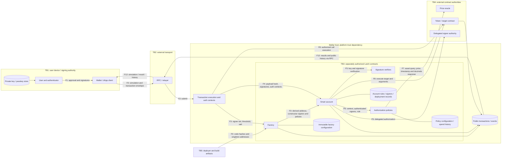
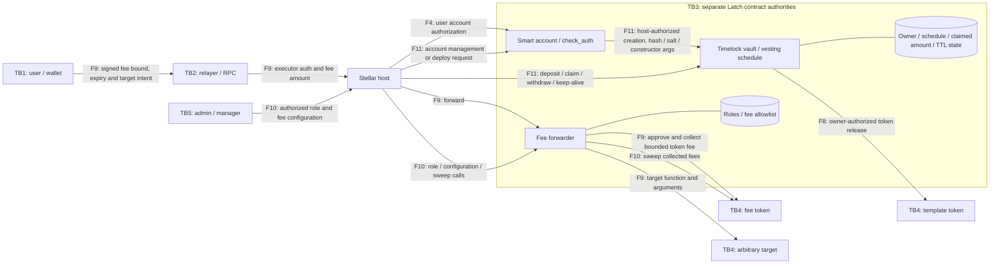

# Latch Contracts — STRIDE Threat Model

Prepared 2026-09-08 against source commit `6b34ccca8488b197bdf09ced67a72e883bb6eb57`.
Status: initial assessment completed; maintainer review and open treatments below remain
pending. This is a design assessment, not an independent audit or a claim that every risk
has been eliminated. No new business risk acceptance is implied by this document.

Method: the four questions and six STRIDE categories from the SDF Audit Bank's
"Threat Modeling Readiness" guidance (linked from the Audit Bank
[official rules](https://github.com/stellar/scf-handbook/blob/main/supporting-programs/audit-bank/official-rules.md)).
Scope, baseline and known accepted risks are in [AUDIT_SCOPE.md](AUDIT_SCOPE.md); executed
test/build evidence is in [TEST_EVIDENCE.md](TEST_EVIDENCE.md).

## 1. What are we working on?

Latch provides Soroban smart accounts with configurable signers and authorization policies.
A factory deterministically derives and deploys an account, allowing its address to be known
and funded before deployment. An account checks authorization through OpenZeppelin's smart
account implementation, external signature verifiers, delegated signers, and installed
policies. Users can execute calls, manage rules/signers, upgrade their account, and deploy
personal timelock or vesting contracts. A permissioned fee forwarder supports sponsored
calls and collects token fees. A multi-token spending policy queries an external price oracle.

### Scope and assets

The 16 production crates in [AUDIT_SCOPE.md](AUDIT_SCOPE.md) are in scope: the smart account,
factory, four verifiers, seven policies, fee forwarder, and two templates. The demo verifier,
dummy fixtures, experimental branch, and clients/services are outside the contract audit.
Client/service interactions are modeled here because their trust assumptions affect contracts;
their implementation and operational controls have not been verified by this review.

Assets to protect are user token balances (including pre-funded addresses), account control,
signer keys, rule integrity, spending/vesting accounting, deployed code identity, fee balances,
and the ability to recover access and establish what was authorized. All ledger data is public.
Private keys, seed phrases, and personal information must remain outside transaction data.

### Actors and trust boundaries

| Boundary | Actors/components on either side | Trust assumption |
|---|---|---|
| TB1 — signer/device | User/authenticator ↔ wallet/client | Device protects keys; client presents the intended network, account, target, arguments, fees and authority. A valid signature alone does not prove informed consent. |
| TB2 — submission | Client ↔ RPC, relayer, Stellar host | RPC/relayer can withhold or misrepresent data; host authorization must enforce the signed intent. Transport acceptance is not transaction finality. |
| TB3 — contract authority | Host ↔ each separately addressed contract; account ↔ verifier/policy/delegated signer | Every cross-contract argument is untrusted until validated. Sharing a repository does not merge contract authority. Installed dependencies and their code must be trustworthy. |
| TB4 — external assets/data | Account/policy/template/forwarder ↔ token, oracle, arbitrary target | Correct interface does not guarantee honest prices, token economics, availability, or safe target behavior. |
| TB5 — operations | Deployer/forwarder role holders/build pipeline ↔ code/configuration | Factory deployment inputs and build provenance must be verified. Forwarder admin/manager/executor keys remain privileged after deployment. |

Attackers include arbitrary callers, a malicious dApp or RPC/relayer, compromised authorized
keys, malicious token/oracle contracts, and compromised build or deployment operators.
Consensus, host cryptography, atomic rollback and authorization semantics are platform
dependencies; this assessment does not independently prove them.

### Dataflow diagram: account creation and authorization

Boxes are processes/entities; cylinders are logical data stores. Subgraphs show authority
domains, not network segmentation. TB3 applies to each call between contract boxes, including
boxes inside the same subgraph. Flow IDs below are reused in the threat register.

F3 address prediction is a read flow as well as creation: the factory normalizes signer
ordering, threshold and salt, then derives an address under that factory. Anyone may create
the account with those parameters; creation is not proof of signer ownership. A copied request
must preserve the same resulting control. Sending tokens to the predicted address uses F8
and can occur before F3 deployment. Clients must verify the factory identity and parameters
before displaying a funding address.

F4–F6 describe authorization callbacks rather than a requirement that every transfer enters
through `execute`: target contracts can directly request account authorization from the host.
Validation returns success or failure through the call stack; failure aborts execution.

### Dataflow diagram: sponsorship, management and personal contracts

F11 includes account `upgrade`, rule/signer management, and template deployment. Account
management requires the account's own authorization; there is no Latch master account key.
`deploy_contract` relies on the host's creation authorization context, not a second explicit
self-authorization call. Template ownership comes from constructor arguments: permission to
deploy a WASM hash must not be mistaken for validation of every constructor argument.

| Data entity | Store / transport | Integrity or confidentiality requirement |
|---|---|---|
| Keys and recovery material | K, user device | Secret; never publish. Device backup/recovery is outside this repo. |
| Authorization payload | F1/F2/F4/F5 | Hash/signature binding, network/nonce/expiry context; public on submission. |
| Factory configuration and account parameters | C, F0/F3 | Verify trusted factory, code hash, signer keys, threshold, salt. Configuration is immutable. |
| Account rules, signers, policies, code and satellite records | S, F4–F6/F11 | Account-controlled mutation; independent instance/persistent storage lifetimes. |
| Policy configuration and spending history | PS, F6/F7 | Per-account/rule isolation; correct units, time windows and accounting. |
| Fee approval, role set and fee balances | FS, fee-token ledger, F9/F10 | Bound fee authority; manager/admin/executor separation. |
| Owner, vesting/timelock state and balances | SS, token ledger, F8/F11 | No unauthorized or premature release; cumulative claims never exceed allocation. |
| Events, call arguments and transaction outcomes | E, F12 | Public and linkable; verify ledger outcome rather than relayer assertions. |

## 2. What can go wrong, and 3. What are we going to do about it?

Priorities below are review priorities, not independently established vulnerability severities.
“Implemented” means code or test evidence was inspected, not that residual risk is zero.
Owners are proposed functional owners; assignment and acceptance require maintainer review.

| ID / priority | Flow and boundary; threat and impact | Treatment, evidence and residual risk | Status / proposed owner |
|---|---|---|---|
| Spoof.1 / high | F1–F5, TB1–3: stolen key, forged signature or replay impersonates an account and spends funds. | Account delegates to OZ `do_check_auth`; verifier suites reject wrong payload/key/signature; host is responsible for transaction nonce/network/expiry binding. Add real signed account transactions including replay/wrong-network/expired-auth rejection. A compromised valid key retains its configured authority. | Implemented checks; full-path evidence open / contracts + clients |
| Spoof.2 / high | F0/F3, TB2/5: substituted factory, signer key or singleton sends pre-funding to attacker-controlled code. | Factory normalizes and salts signer/threshold input; factory tests cover order invariance, changed keys/salt, duplicate signers and idempotent creation. Constructor checks singleton existence, not whether its code is honest. Publish verified deployment hashes; clients independently recompute and verify configuration before funding. | Code controls present; deployment/client verification open / release + clients |
| Spoof.3 / high | F1/F5, TB1: phishing or incorrect passkey ceremony creates valid but unintended authorization. | WebAuthn tests cover challenge/type, user presence/verification and signature checks. OZ 0.7.2 intentionally omits on-chain origin, RP-ID hash, signature-counter and attestation checks. Verify actual wallet RP/origin and transaction display; do not claim the contract enforces domain identity. | Dependency trust assumption; client evidence open / clients |
| Tamper.1 / high | F2/F4/F8/F9, TB2–4: relayer/dApp changes target, arguments or fee to redirect assets. | Signed auth tree and forwarder's bounded fee approval constrain input; fee tests cover excess fee, nested auth and missing authorization. Relayer chooses actual fee within the approved maximum. UI must display the maximum and signed target; a correctly signed malicious call remains possible. | Implemented; wallet-to-relayer signed integration open / contracts + clients |
| Tamper.2 / high | F6/F7, TB4: manipulated prices/precision undercount spend; wrong units, rounding or saturation weaken the cap. | `fetch_price` rejects missing/non-positive/future prices; `enforce` checks freshness, allowed tokens and window total. Tests cover those checks and oracle decimals. Fresh positive prices can still lie. The current formula is `amount * price / 10^oracle_decimals` with saturating arithmetic and integer truncation; it does not query token decimals. Validate dimensional consistency with documented USD units, mixed token decimals, tiny split transfers and extreme values before claiming an economic USD cap. | Partial; candidate accounting concern requires reproduction / contracts |
| Tamper.3 / high | F0/F11, TB3/5: compromised build, singleton or authorized account upgrade installs hostile code. | Lockfile and pinned OZ versions constrain dependency resolution; CI actions are SHA-pinned. `upgrade_requires_self_auth` tests gating. Account upgrade has no storage migration safety check. Verify artifact hashes against a frozen commit; independently review replacement code and migration before upgrades. | Implemented auth; release provenance and future migration open / release + contracts |
| Repudiate.1 / medium | F3/F8/F11/F12, TB2: user/relayer disputes execution or presents a simulation as a final transfer. | Factory/account/template events and transaction history provide evidence; factory event test verifies publication. Archive network, transaction hash, ledger result, code identity and auth context in client support tooling. Key authorization proves key use, not informed human intent. | Ledger evidence exists; operational receipt verification open / clients |
| Repudiate.2 / medium | F9/F10/F12, TB2/5: operator disputes fee collection or privileged role changes. | Preserve signed fee bound, actual collected amount, token events, target result and role-change transaction. Failed target rollback is tested. Define indexing/retention and incident review; do not rely only on relayer logs. | Rollback tested; operator evidence process open / operations |
| Info.1 / medium | F1–F12, TB1–4: public keys, credential metadata, rules and transactions link users or expose sensitive input. | Ledger visibility is intentional. Canonical WebAuthn keys strip credential-ID suffixes, but this does not erase original transaction input. Avoid PII/secrets in rule names, constructor arguments or key metadata; review wallet logging and explain public linkage. | Public-data assumption; client privacy review open / clients |
| Info.2 / high | F0/F1/F10, TB1/5: leaked deployer, relayer or recovery secrets compromise funds/roles. | No production secret storage is needed by these contracts. CI uses read-only permissions. Define secure custody, backup and rotation; verify client recovery behavior separately. This review did not perform a whole-repository secret scan. | Operational control pending / operations + clients |
| DoS.1 / high | F6/F11, TB3: signer changes leave a policy threshold unreachable or no acceptable signer. | Known risk in `AUDIT_SCOPE.md` #1; on-chain enforcement is deferred. Client warning tracked as `latch-mobile#69` only protects that client, and implementation was not verified here. Preserve a usable authority path and ask auditors to assess the accepted limitation. | Previously accepted design risk; mitigation evidence open / clients + maintainers |
| DoS.2 / medium | F6/F11, TB3: dormant instance/persistent entries archive and block access. | Timelock `bump_ttl`/deposit refresh tests pass after Almanax #3 fix. Refreshing owner keys alone is not a complete code/instance lifetime strategy. Document monitoring, code/instance/key restoration and exercise a long-idle recovery on the deployment network. | Partial; recovery runbook/test open / operations + contracts |
| DoS.3 / medium | F3/F5/F6/F7, TB2–4: large input, exhausted spend-history capacity, unavailable oracle or dependency traps block calls. | Recipient lists and spend history have bounds; malformed verifiers fail closed. Factory signer canonicalization uses insertion ordering, so large inputs cost more. Host resource limits bound execution, not application availability. Measure realistic maximum configurations, history exhaustion and RPC/relayer fallback. | Partial; resource and recovery evidence open / contracts + operations |
| Elevation.1 / high | F4/F6/F11, TB3: session signer uses a broad rule or management path to escape restrictions. | Session/account tests cover disallowed calls, expiry, removed rules and composition with spending limits. Account self-auth gates management. Test overlapping Default/CallContract/CreateContract rules, alternate entrypoints and nested invocations with real auth. Restrictions apply to matching rules, not globally to every authority on the account. | Implemented cases; composition coverage open / contracts |
| Elevation.2 / high | F9/F10, TB3/5: non-executor forwards or compromised admin/manager changes roles/tokens and sweeps fees. | Forwarder tests cover missing user/relayer auth, non-executor, non-manager and sweeping. The initial token allowlist accepts all tokens until first enabled; initialize intentionally. Document custody/rotation and limits of each role; manager control over collected fees is intentional. | Code checks present; production configuration/custody open / operations |
| Elevation.3 / high | F6/F8/F11, TB3/4: policy state crosses accounts/rules, or template caller releases another owner's funds. | Policies key configuration by account/rule and require account auth; templates require owner auth and timing conditions. Test suites cover recipient/argument rejection and unauthorized or early claims. Add adversarial cross-account/rule isolation and malicious token interaction coverage where absent. | Implemented checks; adversarial integration evidence incomplete / contracts |

### Treatment exit criteria

| Work item | Threats | Evidence required to close |
|---|---|---|
| TM-A: complete signed integration | Spoof.1/3, Tamper.1, Elevation.1/3 | Reproducible factory → real account → real verifier/policy → token path; sponsored path; negative nonce/expiry/context cases. Explicitly identify remaining mocks. |
| TM-B: verify accounting and dependencies | Tamper.2, DoS.3 | Unit analysis and tests for token/oracle precision, truncation, saturation, price manipulation and capacity; fix demonstrated defects or document reviewed constraints. |
| TM-C: release evidence | Spoof.2, Tamper.3 | One immutable source baseline, passing test/build evidence, corresponding WASM hashes and exact scan versions/commits. |
| TM-D: operational controls | Repudiate.1/2, Info.1/2, DoS.2, Elevation.2 | Reviewed client consent/privacy controls, role custody/rotation, receipt verification and archival recovery instructions with an exercised recovery. |
| TM-E: review residual risks | DoS.1 and all partial/open rows | Maintainer and auditor review; named accountable owners, disposition and rationale. Existing signer-divergence acceptance must not be represented as a shipped mitigation. |

TM-A–E are pre-submission review actions; the panel decides whether disclosed open work is
acceptable for an audit. Confirmed security defects need explicit remediation/disposition.
Operational deployment actions also remain mainnet gates even if an audit is accepted.

## 4. Did we do a good job?

- The diagrams were used during this assessment: every threat references flow IDs and trust
  boundaries; every production contract family appears in the diagrams and scope.
- All six STRIDE categories have concrete threats, treatments, residual limitations and owners.
- The exercise highlighted assumptions not prominent in the prior scope: WebAuthn domain
  checks are off-chain; a well-formed price is not necessarily honest; token/oracle units and
  rounding need validation; the forwarder initially accepts all fee tokens; fixture-based
  integration does not prove complete signature or production deployment behavior.
- Existing treatments have supporting code/tests, but they are not all sufficient to close
  the corresponding threat. Open evidence and candidate concerns are retained above.
- [TEST_EVIDENCE.md](TEST_EVIDENCE.md) records the executed suites and their limitations.
  [Almanax triage](almanax-triage.md) records prior discovered issues and remediation;
  [Scout triage](scout-triage.md) records an incomplete scan, not an all-clear.
- This is the first recorded Latch-specific STRIDE review. No team workshop, independent
  security approval, or subsequent review is claimed. Maintainers should validate the flows
  against wallet/relayer implementations and assign owners before submission.
- Repeat this assessment on signer/rule semantics, verifier/oracle dependencies, fee flow,
  upgrade/storage layout or client trust changes, and after audit findings. Add the changed
  flow, threat, treatment and validating test rather than merely changing the date.

### Source map

Primary code evidence: [account](../latch-smart-account/src/lib.rs),
[factory](../account-factory/contracts/factory-contract/src/lib.rs),
[WebAuthn wrapper](../latch-verifiers/webauthn-verifier/src/lib.rs),
[multi-token policy](../policies/multi-token-spending-limit-policy/src/lib.rs),
[oracle interface](../policies/multi-token-spending-limit-policy/src/oracle.rs),
[forwarder](../fee-forwarder/src/lib.rs),
[timelock](../templates/timelock-vault/src/lib.rs),
[vesting](../templates/vesting-schedule/src/lib.rs).
WebAuthn omissions were checked in the locally resolved `stellar-accounts` 0.7.2
`src/verifiers/webauthn.rs` module documentation; that dependency is pinned by
[Cargo.toml](../Cargo.toml) and [Cargo.lock](../Cargo.lock).
